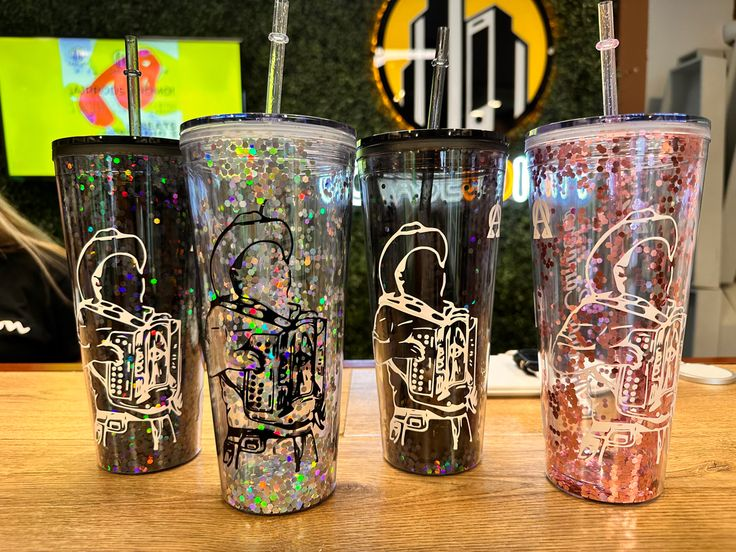
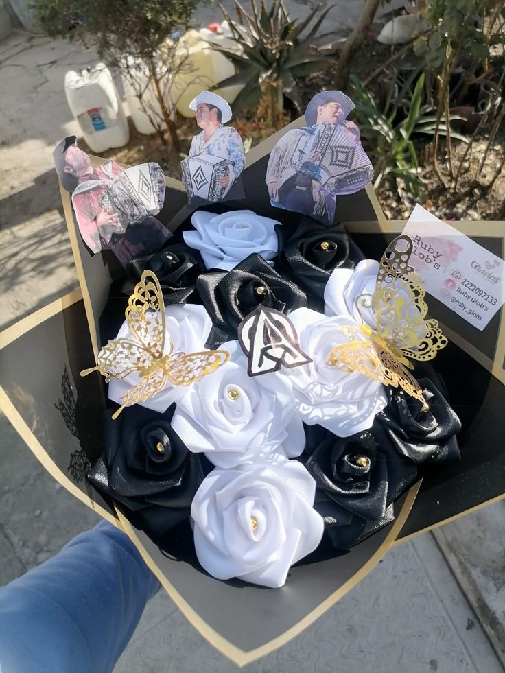
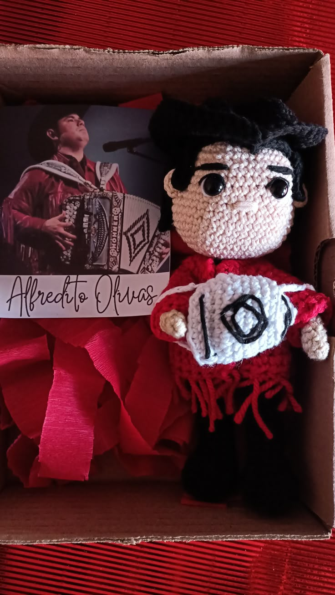
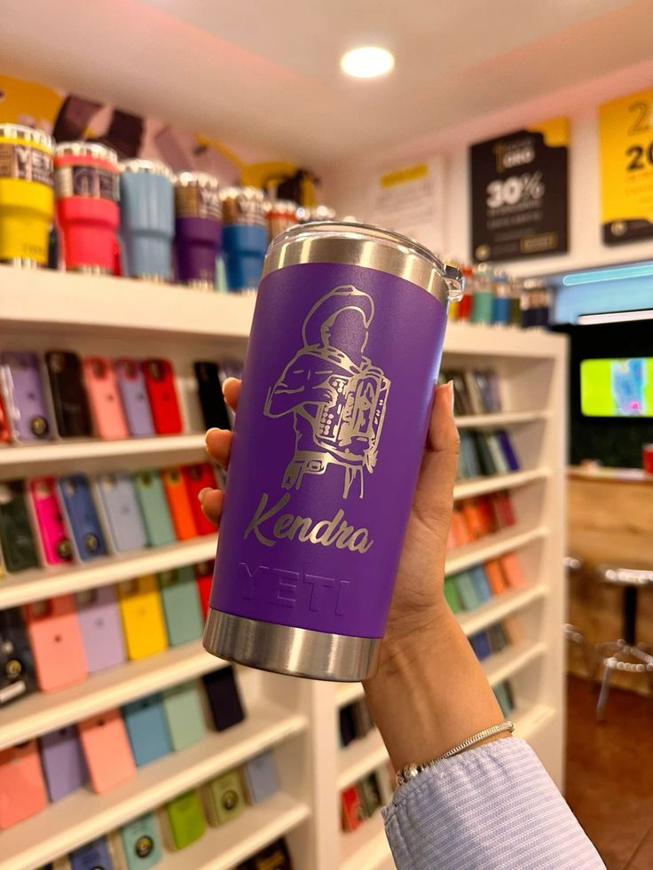
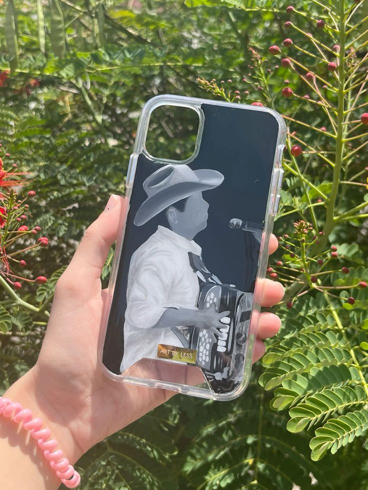
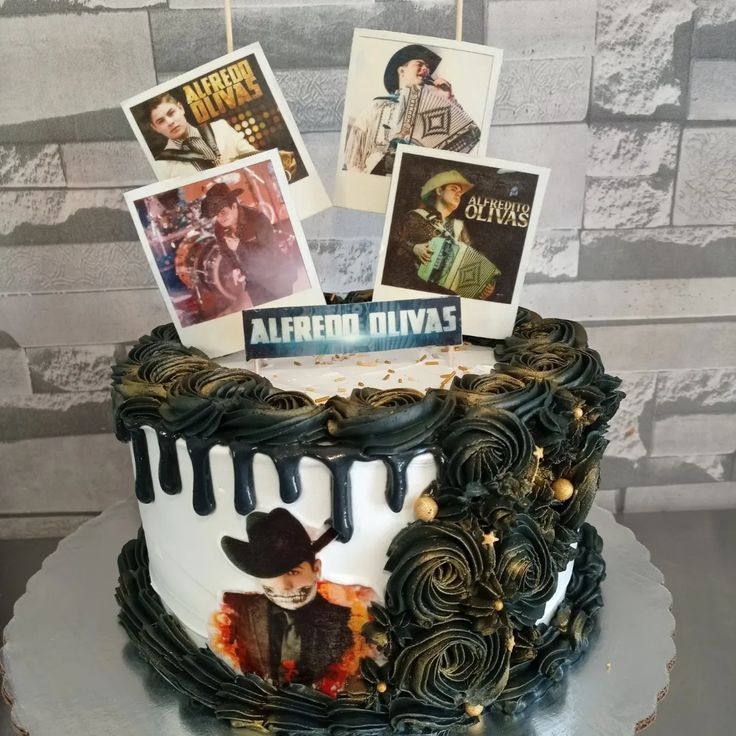

# Tienda-en-Linea-
Obtén los mejores objetos de Alfredo Olivas 
body{
  font-family: 'segoe ui', Tahoa, Geneva, Verdana, sans-serif;
  background-color: wheat;
  margin: 0;
  text-align: center;
  
}
header, footer{
  background-color: blueviolet;
  color: red;
  padding: 1em;
  
}
nav ul{
  list-style: none;
  padding: 0;
}
nav ul li{
  display: inline;
  margin: 0 1em;
}
nav ul li a{
  color: chocolate;
  text-decoration: none;
}
busqueda{
  text-align: center;
  margin-bottom: 1px;
}
#buscador{
  width: 60%;
  padding: 0.5em;
  font-size: 1em;
  border: 1px solid pink;
  border-radius: 5px;
}
main{
  padding: 1em;
}
.productos{
  display: flex;
  flex-wrap: wrap;
  justify-content: space-around;
}
.producto{
  background-color: yellow;
  border-radius: 5px;
  box-shadow: 0 2px 5px #3ef788(0, 0, 0.1);
  margin: 1em;
  padding: 1em;
  text-align: center;
  width: 220px;
  transition: transfore 0.25;
}
.producto,hover{
  transform: scale(1.05);
}
.producto img{
  width: 100%;
  height: auto;
  border-radius: 5px;
}
.descripcion{
  font-size: 0.9 em;
  color: rosybrown;
}
.precio{
  font-weight: bold;
  color: mediumturquoise;
  margin: 0.5em 0;
}
.rating{
  color:"blue";
  margin-bottom: 0.5em;
}
button{
  background-color: green;
  border: none;
  padding: 0.5en 1em;
  border-radius: 3px;
  cursor: pointer;
  font-weight: bold;
}
button:hover {
  background-color: blue;
}
<!DOCTYPE html>

<html lang="es">
<head>
  <meta charset="UTF-8" name="viewport" content="width=device-width, initial-scale=1.0">
  <title> Mi tienda en linea</title>
  <link rel="stylesheet" href="css/style.css">
  <link rel="stylesheet" href="css/responsive.css">
</head>
<body>
  <header>
    <h1>Mi tienda</h1>
    <nav>
      <ul>
        <li><a href="index.html">Inicio</a></a></li>
      <li><a href="productos.html">Productos</a></li>
      <li><a href="carrito.html">Carrito</a></li>
      <li><a href="contacto.html">Contacto</a></li>
      </ul>
    </nav>
  <section class="busqueda">
    <input type="text" id="buscador"  placeholder="Buscar producto..." oninput="filtrarProductos"/>
  </section>
  </header>
<main>
  <h2>Bienvenido a nuestra tienda en linea </h2>
  
Encuentra los mejores productos al mejor precio 

  <section class="ofertas">
    <h2> Oferta del dia </h2>
    

      <figure class="productos">
        
        <figcaption>
          <h3>Vaso Olivas</h3>
          
Es un vaso de 1L tiene tapa y es muy lindo

          
<del>$1500</del>$1000

          
⭐⭐⭐⭐⭐

          <button onclick="Agregaralcarrito(Vaso Olivas2323)">Agregar al carrito</button>
        </figcaption>
      </figure>
      
       <figure class="productos">
        
        <figcaption>
          <h3>Ramo Olivas</h3>
          
Es un lindo ramo ,flores de tela e imagenes 

          
<del>$2500</del>$1500

          
⭐⭐⭐⭐⭐

          <button onclick="Agregaralcarrito(Ramo Olivas2323)">Agregar al carrito</button>
        </figcaption>
          </figure>
      
      <figure class="productos">
        
        <figcaption>
          <h3>Peluche Olivas</h3>
          
Es un peluche tequijo a mano inspirado en el cantante

          
<del>$4000</del>$2000

          
⭐⭐⭐⭐⭐

          <button onclick="Agregaralcarrito(Peluche Olivas2323)">Agregar al carrito</button>
        </figcaption>
          </figure>
      
       <figure class="productos">
        
        <figcaption>
          <h3>Vaso Olivas</h3>
          
Es un vaso de 1L tiene tapa y es muy lindo

          
<del>$2000</del>$1000

          
⭐⭐⭐⭐⭐

          <button onclick="Agregaralcarrito(Vaso Olivas2323)">Agregar al carrito</button>
        </figcaption>
          </figure>
      
      <figure class="productos">
        
        <figcaption>
          <h3>Funda Olivas</h3>
          
Funda bonita personalizada 

          
<del>$1500</del>$1000

          
⭐⭐⭐⭐⭐

          <button onclick="Agregaralcarrito(Funda Olivas2323)">Agregar al carrito</button>
        </figcaption>
          </figure>
      
       <figure class="productos">
        
        <figcaption>
          <h3>Pastel Olivas</h3>
          
Pastel personalizado 

          
<del>$2000</del>$1500

          
⭐⭐⭐⭐⭐

          <button onclick="Agregaralcarrito(Pastel Olivas2323)">Agregar al carrito</button>
        </figcaption>
          </figure>
    

  </section>    
    </main>
<footer> &copy;2025 Mi tienda </footer>

</body>
</html>
